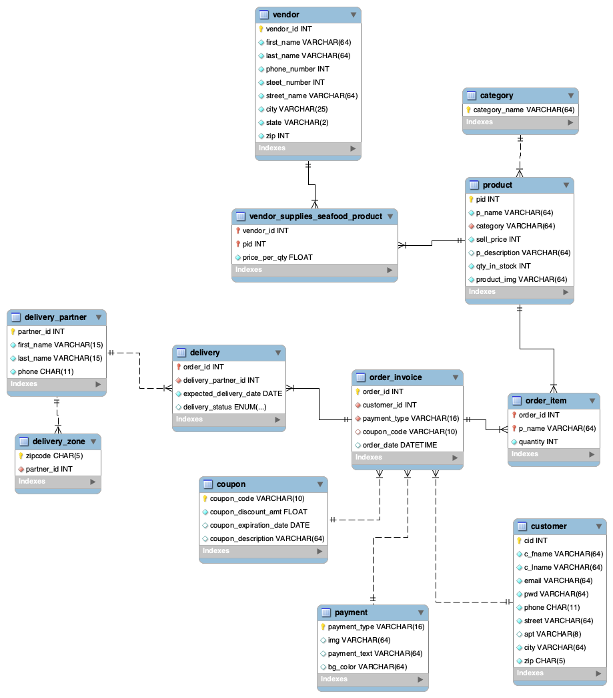

## CS5200 Final Project

### Build and Run

**MySQL Workbench Setup**  
Our front end has two parts: a customer site and a staff portal, both connected to the same remote hosted database. To verify changes made through the front end, create a new connection in [MySQL Workbench] with:

        DB_HOST="db-mysql-nyc1-26951-do-user-14685697-0.c.db.ondigitalocean.com"
        DB_PORT=25060
        DB_USER="doadmin"
        DB_PASSWORD="AVNS_ZxAXLPDXSco1qchGFKp"
        DB_NAME="seafood_service_v4"

**Customer Site**  
How to setup (locally): <br>

```MD
1. Unzip the file
2. Open the terminal inside the files root folder
3. Make a new file named .env.local and put the following code inside it:
    DB_HOST="db-mysql-nyc1-26951-do-user-14685697-0.c.db.ondigitalocean.com"
    DB_PORT=25060
    DB_USER="doadmin"
    DB_PASSWORD="AVNS_ZxAXLPDXSco1qchGFKp"
    DB_NAME="seafood_service_v4"
3. Run "npm install"
4. Run "pip install -r requirements.txt"
5. Run "npm run dev"
6. Navigate to "https://localhost3000" or your specified localhost
7. Or bypass these instructions and access the application in the browser with the link below
```

OR\
Run the application in your browser:

```
1. Navigate to "https://seafood-delivery.vercel.app/"
```

Running as User:

```
1. register an account
2. Begin shopping for items.
3. Check your cart by clicking the cart icon in the nav bar, or the bottom right
4. Check your user profile for coupon codes available & apply the coupon code
5. Click checkout
6. Select a payment method and place order
7. You should now see your order tracking page with your delivery details
```

Running as Admin:

```
1. login with:
    username: admin@seafood.com
    password: admin
2. Click on the "cogwheel" in the top right to redirect to the Admin portal to manage the DB
```

**Admin Portal**  
The admin portal is deployed on [Streamlit Community Cloud], and connected to our remote hosted databse. Through the portal's landing page, select a role to see the corresponding contents. Hover over the tooltip on top of the password box to see the password for each.

To access the deployed portal:

1. follow the above redirection from the customer site
   OR
2. with this direct link: "https://seafoodtradingco.streamlit.app"

OR  
If you want to re-build on your computer and run on localhost instead:

1. Pre: Python 3.8 - Python 3.12, PIP
2. Have both files [isf_config.py], [isf_dbapp.py] in the same directory
3. In CLI, navigate into that directory, run `pip install pymysql pandas streamlit` if not already installed
4. In CLI, in the same directory, run `streamlit run isf_dbapp.py`
5. A webpage should pop up in your browser
6. if not, navigate to "http://localhost:8501" in your browser
7. To stop running the app, from the same terminal, hit `Control` + `C`
8. Note that your localhost is still connecting to our remote hosted db instead of your local db from our dump file

Libraries & Software Needed: <br>
No installation needed for accessing our deployed sites. For building and running locally:

1. hyperlink()

## Tech Stack<br>


<br>

This application is built on Python, React, Next.JS, and MySQL. This is a full-stack application with many different frameworks and libraries to enable its compatibility. Listed below is all the links to each technology used.

[React Installation Documentation](https://react.dev/learn/installation)<br>
[Python Installation Documentation](https://www.python.org/downloads/)<br>
[Streamlit Installation Documentation](https://docs.streamlit.io/library/get-started/installation) <br>
[MySQL Installation Documentation](https://dev.mysql.com/doc/mysql-installation-excerpt/5.7/en/) <br>
[Next.JS Installation Documentation](https://nextjs.org/docs/getting-started/installation) <br>
[Tailwinds Installation Documentation](https://tailwindcss.com/docs/installation) <br>
[React/Tailwinds Docs](https://tailwindcss.com/docs/guides/create-react-app)
[Next.js Documentation](https://nextjs.org/learn-pages-router/basics/create-nextjs-app)

## UML Diagram:


## Logical Design (reverse engineer)



## User Flow

Commands the user uses: <br>

1. register_user
2. sign_in
3. add_item_to_order
4. get_all_coupons
5. place_order
6. remove_item_from_inventory
7. get_payment_methods
8. get_all_inventory

## Lessons Learned

1. Through developing this application, we as a team learned many valuable skills. First we built a full-stack application, and this project helped us paint the picture how a database handles requests to and from it. We saw how a user can go from signing up on our platform, and go through a shopping experience, and have all of this data reflected in the database. We learned how to interact with MySQL and write a functioning database, encompassed with many procedures that simplified the backend process. We learned how to stand-up and deploy a front-end that is capable of handling requests from the user and fetch these from the backend and make the reflected changes. Our tech stack was wide, and we got to dip our toes into some new languages. <br>

2. Some insight we gained as a team was <br>

3. From our initial proposal through to our final draft, we had made many revisions of our project. What we thought would work at the start ended up not being ideal, and so we made changes to our project. Please refer to our user flow diagram to see our final state. Essentially, we built two portals. One for the user experience, and one for the admin perspective. Both sides of the house guarantee functional CRUD operations for different scenarios. For example, on the user side, a user is able to register an account, and perform some shopping activity. The user has their own account, and their own shopping cart. The user also has coupon codes. When the user checksout, our database is updated to reflect these changes (i.e. items and their quantity are removed from the shop, and the users coupon has been applied). <br>
   From the admin side of the house, we have functioning CRUD operations such that the admin has the power to add, or remove users from the database. The admin has the ability to add, or remove new rows, or columns to various tables such as the product they are selling, or the delivery_partners that they work with.<br> 4. All code is working.

## Future Work

1. The planned use of this database is to act as a store-front for a local seafood shop in Boston. The idea is that users come to this website to shop for their seafood. We hope that this database continues to grow, and that we can blend it into a local shop in Boston. <br>
2. Potentially, we can add different grocery types and expand out of just Seafood. We hope that in the future, we can add more procedures for many more operations as new use-cases arise.<br>

<!-- auto references -->

[Streamlit Community Cloud]: https://streamlit.io/cloud
[MySQL Workbench]: https://dev.mysql.com/doc/mysql-installation-excerpt/5.7/en/
[isf_config.py]: isf_config.py
[isf_dbapp.py]: isf_dbapp.py
